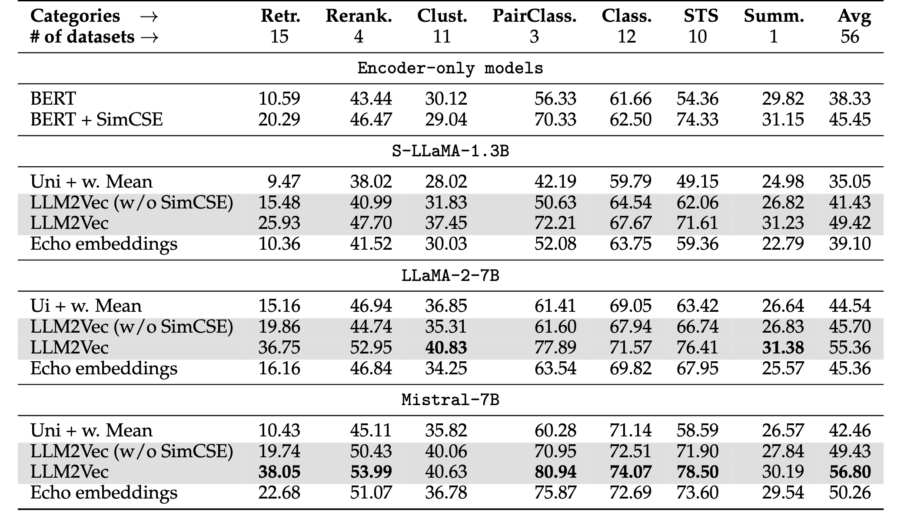
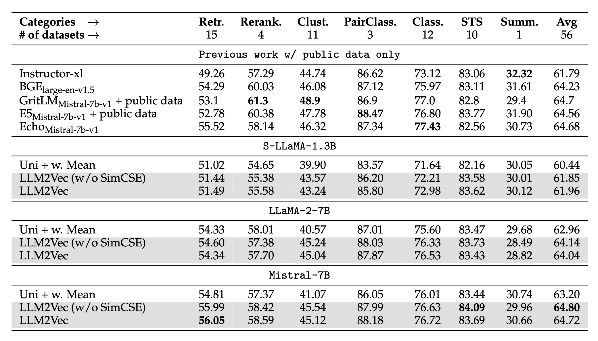
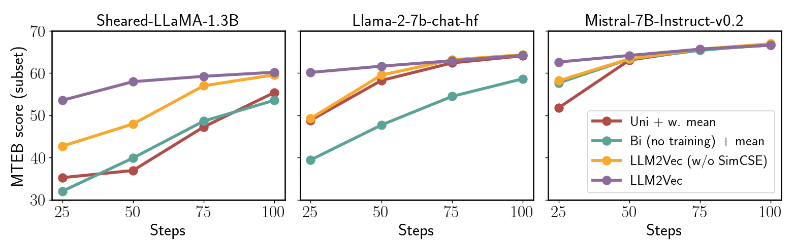

# LLM2Vec: Large Language Models Are Secretly Powerful Text Encoders

*Authors: Parishad BehnamGhader\*, Vaibhav Adlakha\*, Marius Mosbach, Dzmitry Bahdanau, Nicolas Chapados, Siva Reddy*


Text embedding models convert a piece of text such as a search query, a document, or pieces of code into a sequence of real-valued numbers. Given such embeddings, we can measure the similarity or relatedness of pieces of text which facilitates various important applications such as search, clustering, retrieval, and classification.

With the widespread availability of large decoder-only language models (LLMs) such as GPT-4, LLaMA2, Mistral-7B, or StarCoder2, a pressing question in the NLP research community is how to best use these models to construct powerful text embeddings. 

We are excited to present [LLM2Vec: Large Language Models Are Secretly Powerful Text Encoders](link), a simple and efficient solution to transform *any* decoder-only LLM into a powerful text encoder.

Below we give an overview of LLM2Vec and provide a hands-on tutorial that walks you through the steps of transforming a decoder-only LLM into a powerful text encoder.

## A simple and efficient recipe

At its core, LLM2Vec consists of three simple steps: 1) enabling bidirectional attention, 2) adaptation via masked next token prediction (MNTP), and 3) adaptation via unsupervised contrastive learning.

Adapting a model with the LLM2Vec approach is highly efficient and works with parameter-efficient fine-tuning methods such as LoRA. Additionally, the adaptation can be performed using a general domain corpus such as Wikipedia, requires only a few hundred training steps, and can be run on a single GPU.


## State-of-the-art performance

LLM2Vec is not only simple and efficient, it also leads to state-of-the-art performance on the challenging Massive Text Embeddings benchmark (MTEB), both in the unsupervised and supervised setting (among models trained only on publicly available data).  

### Unsupervised results

We apply LLM2Vec to some of the best-performing LLMs available and evaluate the resulting text embedding models on MTEB. In the unsupervised setting, i.e., without using any labeled training data for contrastive learning, our LLM2Vec transformed models achieve a new state-of-the-art performance of $56.80$, outperforming previous unsupervised approach by a large margin.



### Supervised results

LLM2Vec does not only provide state-of-the-art performance in the unsupervised setting, it can also be easily combined with supervised contrastive learning. As our results show, applying LLM2Vec before supervised contrastive learning leads to a substantial improvement. Moroever, LLM2Vec in combination with Mistral-7B, the currently best-performing 7B parameter language model, leads to a new state-of-the-art performance of $64.80$ on MTEB among models trained only with publicly available data. 



## Highly sample-efficient

LLM2Vec transformed models are not only capable of achieving state-of-the-art performance, they also require less training data to perform well, compared to training models without the LLM2vec transformation.



These results make us particularly excited about challenging real-world scenarios where large amounts of labeled data might be costly to aquire.

## Use it on your own data

We have made it very easy for you to use our LLM2Vec transformed models. LLM2Vec class is a wrapper on top of HuggingFace models to support sequence encoding and pooling operations. The steps below showcase an example on how to use the library.

### Preparing the model

Here, we first initialize the model and apply MNTP-trained LoRA weights on top. After merging the model with MNTP weights, we can
- either load the unsupervised-trained LoRA weights (trained with SimCSE objective and wiki corpus)
- or we can load the model with supervised-trained LoRA weights (trained with contrastive learning and public E5 data).

```python
import torch
from transformers import AutoTokenizer, AutoModel, AutoConfig
from peft import PeftModel

config = AutoConfig.from_pretrained("McGill-NLP/LLM2Vec-Sheared-LLaMA-mntp", trust_remote_code=True)
tokenizer = AutoTokenizer.from_pretrained("McGill-NLP/LLM2Vec-Sheared-LLaMA-mntp")

# Loading base MNTP model, along with custom code that enables bidirectional connections in decoder-only LLMs
tokenizer = AutoTokenizer.from_pretrained(
    "McGill-NLP/LLM2Vec-Mistral-7B-Instruct-v2-mntp"
)
config = AutoConfig.from_pretrained(
    "McGill-NLP/LLM2Vec-Mistral-7B-Instruct-v2-mntp", trust_remote_code=True
)
model = AutoModel.from_pretrained(
    "McGill-NLP/LLM2Vec-Mistral-7B-Instruct-v2-mntp",
    trust_remote_code=True,
    config=config,
    torch_dtype=torch.bfloat16,
    device_map="cuda" if torch.cuda.is_available() else "cpu",
)
model = PeftModel.from_pretrained(
    model,
    "McGill-NLP/LLM2Vec-Mistral-7B-Instruct-v2-mntp",
)
model = model.merge_and_unload()  # This can take several minutes on cpu

# Loading unsupervised-trained LoRA weights. This loads the trained LoRA weights on top of MNTP model. Hence the final weights are -- Base model + MNTP (LoRA) + SimCSE (LoRA).
model = PeftModel.from_pretrained(
    model, "McGill-NLP/LLM2Vec-Mistral-7B-Instruct-v2-mntp-unsup-simcse"
)

# Or loading supervised-trained LoRA weights
model = PeftModel.from_pretrained(
    model, "McGill-NLP/LLM2Vec-Mistral-7B-Instruct-v2-mntp-supervised"
)

```

### Applying `LLM2Vec` wrapper

Then, we define our LLM2Vec encoder model as follows:

```python
from llm2vec import LLM2Vec

l2v = LLM2Vec(model, tokenizer, pooling_mode="mean", max_length=512)
```

### Inference

This model now returns the text embedding for any input in the form of `[[instruction1, text1], [instruction2, text2]]` or `[text1, text2]`. While training, we provide instructions for both sentences in symmetric tasks, and only for for queries in asymmetric tasks.

```python
# Encoding queries using instructions
instruction = (
    "Given a web search query, retrieve relevant passages that answer the query:"
)
queries = [
    [instruction, "how much protein should a female eat"],
    [instruction, "summit define"],
]
q_reps = l2v.encode(queries)

# Encoding documents. Instruction are not required for documents
documents = [
    "As a general guideline, the CDC's average requirement of protein for women ages 19 to 70 is 46 grams per day. But, as you can see from this chart, you'll need to increase that if you're expecting or training for a marathon. Check out the chart below to see how much protein you should be eating each day.",
    "Definition of summit for English Language Learners. : 1  the highest point of a mountain : the top of a mountain. : 2  the highest level. : 3  a meeting or series of meetings between the leaders of two or more governments.",
]
d_reps = l2v.encode(documents)

# Compute cosine similarity
q_reps_norm = torch.nn.functional.normalize(q_reps, p=2, dim=1)
d_reps_norm = torch.nn.functional.normalize(d_reps, p=2, dim=1)
cos_sim = torch.mm(q_reps_norm, d_reps_norm.transpose(0, 1))

print(cos_sim)
"""
tensor([[0.5485, 0.0551],
        [0.0565, 0.5425]])
"""
```

----

Research: [text](link)

Code: [text](link)

Tutorial: [text](link)
